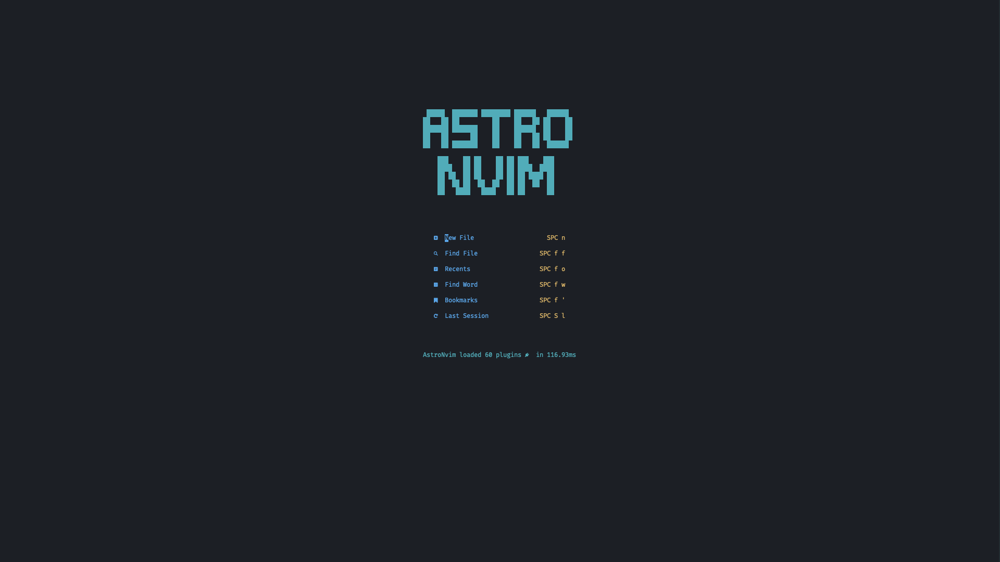
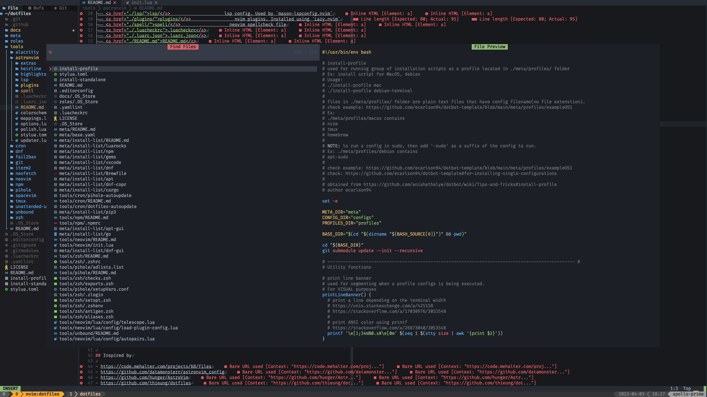
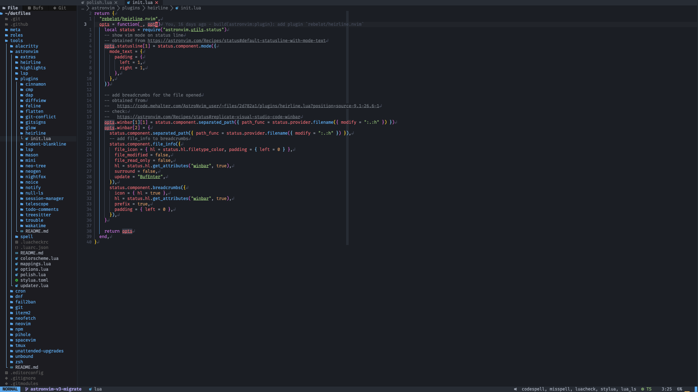
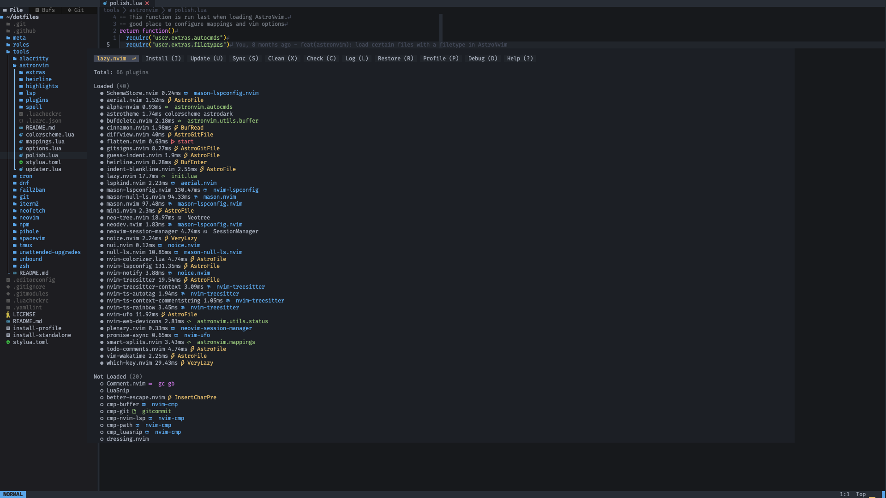
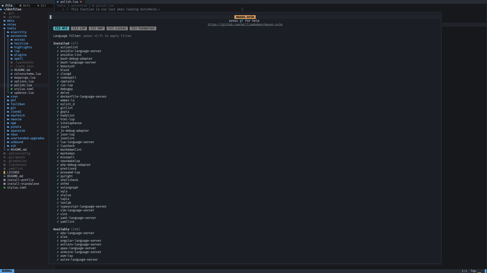
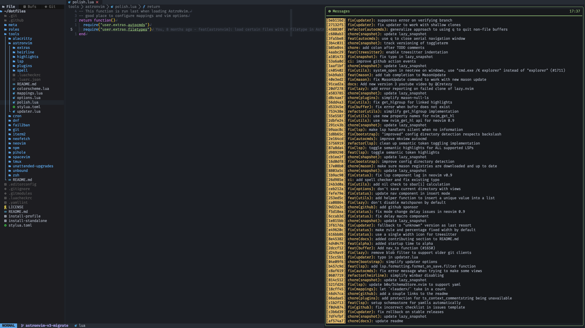

# astronvim/

AstorNvim custom configs

This folder is intended to be symlinked to `$XDG_CONFIG_HOME/astronvim/lua/user/`

## dotbot config

Used by [dotfiles/meta/configs/astronvim.yaml](../../meta/configs/astronvim.yaml)

## screenshot

## File/Directory structure

<!--
loaded tree structure with
tree -a -H "." tools/astronvim -L 1
-->

<pre>
<a href="../../../../">dotfiles/</a>tools/vim/astronvim/
├── <a href="./extras/">extras/</a>                  extra configs related to astronvim
├── <a href="./heirline/">heirline/</a>                heirline statusline
├── <a href="./highlights/">highlights/</a>              telescope theme customization
├── <a href="./lsp/">lsp/</a>                     lsp config. Used by `mason-lspconfig.nvim`
├── <a href="./plugins/">plugins/</a>                 nvim plugins. Installed using `Lazy.nvim`
├── <a href="./spell/">spell/</a>                   neovim spellcheck file
├── <a href="./.luacheckrc">.luacheckrc</a>
├── <a href="./.luarc.json">.luarc.json</a>
├── <a href="./README.md">README.md</a>
├── <a href="./colorscheme.lua">colorscheme.lua</a>          neovim colourscheme
├── <a href="./mappings.lua">mappings.lua</a>             which-key mappings. Uses ./extras/mappings/
├── <a href="./options.lua">options.lua</a>              neovim system configs
├── <a href="./polish.lua">polish.lua</a>               to run last after initializing neovim
├── <a href="./stylua.toml">stylua.toml</a>
└── <a href="./updater.lua">updater.lua</a>              config on how to update Astronvim
</pre>

### extras/

Extra config files that don't fit in other folder.
Ex: which-key mappings
Ex: file to run in `polish.lua`

### heirline/

[Heirline](https://github.com/rebelot/heirline.nvim) statusbar attribute config

### highlights/

Custom theme for [telescope](https://github.com/nvim-telescope/telescope.nvim)

### lsp/

Contains configs for [neovim/nvim-lspconfig](https://github.com/neovim/nvim-lspconfig)

Language Servers are installed with [williamboman/nvim-lsp-installer](https://github.com/williamboman/nvim-lsp-installer)

### plugins/

Contains plugin configs. To be used by `Lazy.nvim`

### spell/

Neovim spellcheck file

### colorscheme.lua

Neovim color scheme to use

### mappings.lua

which-key mappings. Uses [`./extras/mappings/`](./extras/mappings)

### polish.lua

This file is run last.

Good place to configuring augroups/autocommands and custom filetypes

### updater.lua

Used by AstroNvim when updating

https://astronvim.com/Configuration/updater

## Inspired by

- https://code.mehalter.com/projects/68/files
- https://github.com/datamonsterr/astronvim_config
- https://github.com/hunger/AstroVim
- https://github.com/thieung/dotfiles
